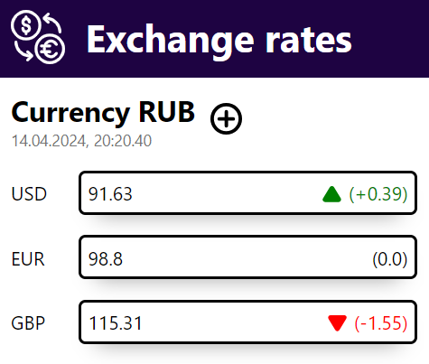

# Exchange rates
Проект представляет собой веб приложение, написанное на [Angular](https://angular.io/), которое отображает курсы валют к рублю

> Проект разработан в качестве тестового задания для стажировки

Изначально показываются 3 валюты (USD, EUR, GBR), через иконку "+" можно добавить еще 3 (CNY, JPY, TRY).

Данные о курсах валют получены с ресурса https://api.apilayer.com/currency_data/live.
Описание api: https://apilayer.com/marketplace/currency_data-api.

> **Внимание!** `Apilayer` предоставляет в бесплатном доступе только сто запросов в месяц,
> которые очень быстро исчерпываются, что приводит к невозможности полноценного отображения приложения.
>
> В проекте есть специальное поле, через которое можно вставить свой собственный ключ доступа к АПИ,
> для тестирования приложения

## Особенности проекта
* проект разработан с применением фреймворка [Angular 17](https://angular.io/),
* проект разработан с применением адаптивного дизайна и хорошо работает как на десктопе, так и на мобильных устройствах,
* проект разработан с применением архитектуры [Feature-Sliced Design](https://feature-sliced.design/),
* в проекте присутствует документация в формате [JSDoc](https://jsdoc.app/),
* у проекта настроен автоматический deploy на GH pages с помощью GitHab Actions; файл для настройки ci/cd находится в директории [./.github/workflows](/.github/workflows)

## Скриншот



## Как запустить проект

### Вариант 1 - GH pages

Проект расположен на GitHub Pages.
Достаточно открыть ссылку: https://pashabezk.github.io/ExchangeRates/

### Вариант 2 - Локальный запуск

Для локального запуска необходимо выполнить следующий скрипт:

```sh
# клонировать репозиторий
git clone https://github.com/pashabezk/ExchangeRates.git

# установить зависимости (только при первом запуске)
nmp install

# создать файл с секретами (для безопасности секреты не пушатся в репозиторий)
touch src/environments/secrets.ts # создание файла
echo "export const API_KEY = 'your_token';" > src/environments/secrets.ts # создание переменной с токеном
# подробнее про токен под скриптом

# запустить проект
npm start
```

> **Подробнее про токен:**
> Для корректной работы приложения ему необходим токен Apilayer (https://apilayer.com/marketplace/currency_data-api).
> На сайте есть пробный период с небольшим количеством запросов. _Без токена приложение работать не будет!_

После выполнения скрипта необходимо открыть в браузере http://localhost:4200/.

## Использованные ресурсы
В приложении использовались иконки с сайта [svgrepo](https://www.svgrepo.com/):
* https://www.svgrepo.com/svg/290061/exchange-euro
* https://www.svgrepo.com/svg/509388/plus-circle
* https://www.svgrepo.com/svg/448188/triangle
